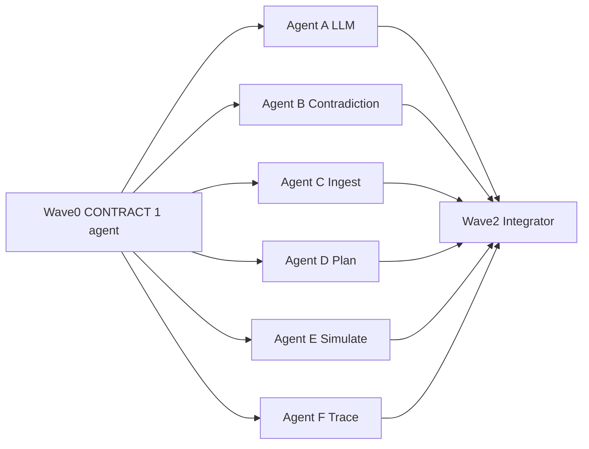
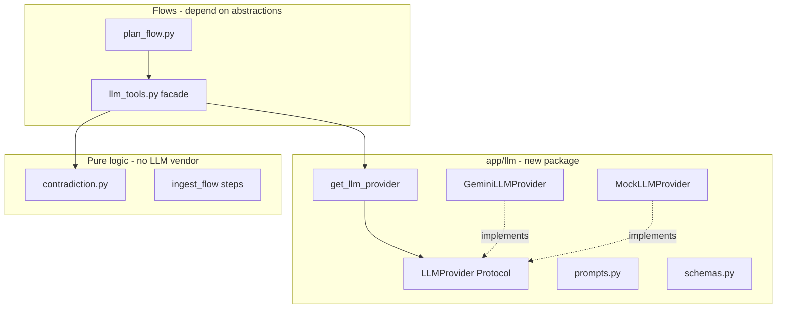

# Zain — Backend Foundation Implementation Plan

**Scope:** [backend/cityira-backend-handoff.md](backend/cityira-backend-handoff.md) (Zain section). **Parallel briefs:** [backend/docs/ZAIN_PARALLEL_AGENT_BRIEFS.md](backend/docs/ZAIN_PARALLEL_AGENT_BRIEFS.md).

**Out of scope:** `app/nodes/`, multi-node graphs, full pytest (Shaka), route 409 polish (Eagle).

**Success criteria:** Handoff checklist + `./backend/scripts/smoke_test.sh` with `MOCK_LLM=true`.

---

## Parallel execution (start here)

The work **is distributable** if you use a **contract-first Wave 0**, then **six non-overlapping file owners** in Wave 1. No agent should wait on another’s implementation except Wave 0 (short) and the final integrator.



### File ownership matrix (no collisions)

| Agent | Branch | May write | Must not write |
|-------|--------|-----------|----------------|
| **CONTRACT** | `zain/wave-0-contracts` | `app/llm/{schemas,protocol,prompts,mock_provider,factory,__init__}.py`, `tools/contradiction.py` stubs, `tools/llm_tools.py` delegate | All `flows/*`, `graphs/*`, most routes |
| **A LLM** | `zain/agent-a-llm` | `app/llm/{gemini_provider,base}.py`, extend `factory.py`, `llm_tools.py` | `contradiction.py`, `flows/*` |
| **B Contradiction** | `zain/agent-b-contradiction` | `tools/contradiction.py` only | `llm_tools.py`, `flows/*`, `llm/gemini*` |
| **C Ingest** | `zain/agent-c-ingest` | `flows/ingest_flow.py` only | `tools/*`, `llm/*`, other flows |
| **D Plan** | `zain/agent-d-plan` | `flows/plan_flow.py` only | `tools/*` (import only), `llm/*` |
| **E Simulate** | `zain/agent-e-simulate` | `flows/simulate_flow.py` only | everything else |
| **F Trace** | `zain/agent-f-trace` | `trace_builder.py` filter fn, `trace_flow.py`, `api/routes/trace.py`, `baseline.py` | `flows/ingest|plan|simulate` |
| **INTEGRATOR** | `zain/wave-2-integrate` | conflict fixes + smoke only | no new features |

**Why Plan (D) does not block on LLM (A):** `plan_flow` calls `llm_tools.classify_incident()` — Wave 0 already delegates that to **MockLLMProvider**. Agent A upgrades Gemini without touching `plan_flow.py`.

**Why Plan (D) does not block on Contradiction (B):** Wave 0 stubs return `[]` groups; Agent D wires `detect_contradictions` / `resolve_contradictions` to `contradiction.*` imports. Agent B fills real logic in the same module without editing `plan_flow.py`.

### Frozen public APIs (Wave 0 must land these signatures)

```python
# app/llm/schemas.py — Pydantic models per plan.md §4.10.3 + ContradictionGroup

# app/llm/protocol.py
class LLMProvider(Protocol):
    def classify(self, incident: Incident) -> ClassificationResult: ...
    def draft_notifications(self, incident_id: str, incident_type: str) -> NotificationDrafts: ...

# app/tools/contradiction.py
def detect_contradiction_groups(incidents: list[Incident]) -> list[ContradictionGroup]: ...
def resolve_group(incidents: list[Incident]) -> ResolvedConflict: ...

# app/tools/llm_tools.py — stable for Eagle/Shaka
def classify_incident(incident: Incident) -> dict: ...
def resolve_contradiction(incidents: list[Incident]) -> dict: ...
def draft_notifications(incident_id: str, incident_type: str) -> dict[str, str]: ...
```

### How to spin multiple agents in parallel

#### Option 1 — Cursor (recommended for this repo)

1. **Wave 0:** One Agent/Composer chat → paste **Agent CONTRACT** brief from [ZAIN_PARALLEL_AGENT_BRIEFS.md](backend/docs/ZAIN_PARALLEL_AGENT_BRIEFS.md) → merge to `main`.
2. **Wave 1:** Open **six separate** Agent/Composer chats (or Background Agents if enabled).
3. In each chat, attach: `@backend/docs/ZAIN_PARALLEL_AGENT_BRIEFS.md`, `@plan.md` (§4.10), `@backend/cityira-backend-handoff.md`, and **only** the files that agent owns.
4. Give each chat: branch name + “Do not edit files outside ownership matrix.”
5. Use **git worktrees** so agents do not stomp the same working tree:

```bash
cd "/media/zainamjad2511/New Volume1/googleaiseekho-hackathon"
git checkout main && git pull
git worktree add ../cityira-agent-a -b zain/agent-a-llm
git worktree add ../cityira-agent-b -b zain/agent-b-contradiction
# ... repeat for c, d, e, f
# Open each worktree folder in its own Cursor window → one agent per window
```

6. **Wave 2:** One integrator chat on `main`; merge PRs/branches in order below; run smoke.

#### Option 2 — Google Antigravity IDE

Same wave structure; per session:

1. Create a **new Antigravity task** per agent (separate `task.md` / session).
2. Paste the matching persona + ownership list from the briefs doc.
3. Point each session at the **same GitHub repo** but **different branch** (Antigravity often works in a single clone — use worktrees or branches and explicit “only commit files X,Y,Z”).
4. Export artifacts (`task.md`, `walkthrough.md`) per agent for hackathon judges.

#### Option 3 — Cursor Cloud / Task tool

Launch multiple `generalPurpose` or `explore` subagents with the **full brief** in the prompt and `readonly: false`, each assigned one branch name and file list. You (Zain) still merge locally.

### Suggested personas (copy into each agent’s system / first message)

| Agent | Persona (one paragraph) |
|-------|-------------------------|
| **CONTRACT** | Backend architect; freeze interfaces only; mock LLM works end-to-end; no flow refactors. |
| **A LLM** | LangChain + Gemini structured-output specialist; SOLID providers; never touch flows or contradiction algorithms. |
| **B Contradiction** | Geospatial + scoring algorithms; credibility/recency math; zero LLM SDK imports. |
| **C Ingest** | Ingest validation/normalization; duplicate detection; no LLM. |
| **D Plan** | Triage pipeline orchestration; imports tools by API only; no edits outside `plan_flow.py`. |
| **E Simulate** | State machine + animation frames; no LLM. |
| **F Trace** | Trace depth filtering + baseline keyword audit; no flow refactors. |
| **INTEGRATOR** | Merge + smoke only; fix import conflicts; no scope creep. |

### Merge order

1. `zain/wave-0-contracts` → `main`
2. Parallel merges (any order): **B, C, E, F**
3. **A** (llm package)
4. **D** (plan_flow; best after B)
5. `zain/wave-2-integrate` → smoke green

### What is NOT parallelizable

- **Wave 0** must finish first (~45–90 min). Without frozen schemas + mock factory, agents will invent incompatible types.
- **Wave 2 integrator** must run last.
- Do **not** split one file across agents (e.g. two agents editing `plan_flow.py`).

---

## Current baseline (what you inherit)

| Area | Today | Your target |
|------|--------|-------------|
| [backend/app/tools/llm_tools.py](backend/app/tools/llm_tools.py) | Mock keyword classify; Market Quarter hardcode in `resolve_contradiction` | Provider-backed Gemini + mock; real contradiction math |
| Flows | Monolithic `run_ingest` / `run_plan` / `run_simulate` | Discrete step functions + thin orchestrators |
| LLM schemas | Missing (`ClassificationResult`, etc. only in [plan.md](plan.md) §4.10.3) | Pydantic models in backend |
| [backend/app/flows/trace_flow.py](backend/app/flows/trace_flow.py) | `depth` ignored in [trace route](backend/app/api/routes/trace.py) | `summary` vs `full` filtering |
| Graphs | Single-node stubs calling `run_*` | Unchanged until Eagle; orchestrators must keep working |

---

## Architecture: SOLID + swappable LLM



| Principle | How you apply it |
|-----------|------------------|
| **S** | `GeminiLLMProvider` only talks to Gemini; `contradiction.py` only scores/groups; `llm_tools.py` only delegates |
| **O** | Add `OpenAILLMProvider` later by new file + factory branch—no edits to flows |
| **L** | Mock and Gemini both satisfy `LLMProvider`; same return types |
| **I** | One `LLMProvider` protocol with three methods (classify, resolve, draft)—not one giant “AI service” |
| **D** | Flows import facade/factory, never `ChatGoogleGenerativeAI` directly |

### New files (recommended layout)

```
backend/app/llm/
  __init__.py
  schemas.py          # ClassificationResult, ResolvedConflict, NotificationDrafts, ContradictionGroup
  prompts.py          # plan.md §4.10.4 system prompts + temperatures
  protocol.py         # LLMProvider (typing.Protocol)
  base.py             # optional: shared invoke_with_retry(parse_fn, fallback)
  gemini_provider.py  # structured output via langchain-google-genai
  mock_provider.py    # move existing _mock_* logic here
  factory.py          # get_llm_provider(settings) -> LLMProvider

backend/app/tools/
  contradiction.py    # detect_contradiction_groups, score_source, resolve_by_credibility
  llm_tools.py        # thin public API (unchanged function names for Eagle/Shaka imports)
```

### `LLMProvider` contract (sketch)

```python
class LLMProvider(Protocol):
    def classify(self, incident: Incident) -> ClassificationResult: ...
    def resolve_contradiction(self, incidents: list[Incident]) -> ResolvedConflict: ...
    def draft_notifications(self, incident_id: str, incident_type: str) -> NotificationDrafts: ...
```

**Factory** ([backend/app/config.py](backend/app/config.py)):

- `MOCK_LLM=true` **or** empty `GOOGLE_API_KEY` → `MockLLMProvider`
- Else → `GeminiLLMProvider(model=settings.llm_model, api_key=...)`

**Shared behavior** (in `base.py` or gemini provider):

- Structured Pydantic parse via LangChain `with_structured_output`
- Temperatures: classify/resolver `0.2`, notifications `0.4` (plan.md §4.10.4)
- On parse failure: **retry once**, then provider-specific safe defaults (`other`/`medium`, confidence flag, template drafts)

**Contradiction resolution split** (resolves Task 1 vs Task 2 tension):

1. **Deterministic winner** in [contradiction.py](backend/app/tools/contradiction.py) per handoff Task 2 (credibility table + `exp(-ageMinutes/30)`).
2. **LLM** enriches `rationale` / narrative when live provider is active; mock uses algorithm-only output.
3. If `confidence < 0.6` → set `lowConfidenceResolution` on result (flows read this in `resolve_contradictions`).

Public imports stay stable: `from app.tools import llm_tools` — Eagle does not need to know Gemini exists.

---

## Implementation phases (ordered)

### Phase 0 — Environment and schemas

1. `cd backend && uv sync` — [langchain-google-genai](backend/pyproject.toml) already listed.
2. Copy [backend/.env.example](backend/.env.example) → `.env`; set `GOOGLE_API_KEY` for manual Gemini checks; keep `MOCK_LLM=true` for daily dev.
3. Add [backend/app/llm/schemas.py](backend/app/llm/schemas.py) matching plan.md §4.10.3 (`ClassificationResult`, `ResolvedConflict`, `NotificationDrafts`, `ContradictionGroup`).
4. Add mappers: `ClassificationResult` ↔ internal `IncidentType`/`Severity` enums (flows today use enums in dicts—normalize at facade boundary).

**Checkpoint:** import schemas from tests/REPL without side effects.

---

### Phase 1 — LLM abstraction + Gemini wiring (Handoff Task 1)

1. Implement `prompts.py` with exact anchor strings from handoff/plan §4.10.4.
2. Implement `MockLLMProvider` — port logic from current [llm_tools.py](backend/app/tools/llm_tools.py) `_mock_classify` and notification templates.
3. Implement `GeminiLLMProvider`:
   - `ChatGoogleGenerativeAI` + `with_structured_output(YourPydanticModel)`
   - User payload: description, `sourceType`, `sourceMetadata`, coordinates
4. Implement `factory.get_llm_provider()`.
5. Refactor [llm_tools.py](backend/app/tools/llm_tools.py) to:

```python
def classify_incident(incident: Incident) -> dict:
    result = get_llm_provider().classify(incident)
    return result.model_dump()  # or enum-compatible dict for existing plan_flow
```

6. Wire `draft_notifications` and LLM `resolve_contradiction` through provider (resolution body still uses Phase 2 math for winner selection).

**Checkpoint:** With `MOCK_LLM=false` + key, single incident classifies via API; with mock, behavior matches today’s keyword rules.

---

### Phase 2 — Contradiction detection (Handoff Task 2)

New [contradiction.py](backend/app/tools/contradiction.py):

| Function | Responsibility |
|----------|----------------|
| `haversine_m(a, b)` | Reuse or mirror geo distance (200 m threshold) |
| `detect_contradiction_groups(incidents)` | Cluster: same 200 m + 60 min window; flag if type differs OR severity >1 level apart |
| `score_source(incident, now)` | `0.6 * SOURCE_WEIGHT + 0.4 * exp(-ageMinutes/30)` |
| `resolve_group(incidents) -> ResolvedConflict` | Pick winner; build `resolution` via `classify_incident(winner)`; `confidence` from score gap; `lowConfidenceResolution` if `< 0.6` |

Replace Market Quarter hardcode in `resolve_contradiction` with `resolve_group`.

**Checkpoint:** Seed/demo pair (Market Quarter) resolves to `water_leak` via `csv_json` over `web_article` without lat-specific `if` branches.

---

### Phase 3 — Ingest flow decomposition (Handoff Task 3)

Refactor [ingest_flow.py](backend/app/flows/ingest_flow.py):

| Step function | Behavior (plan.md §4.1) |
|---------------|-------------------------|
| `validate_input(body) -> ApiError \| None` | Min 10 chars; valid `sourceType` |
| `normalize_timestamp(raw) -> tuple[str, str]` | ISO parse or UTC now + warning path |
| `normalize_location(store, body) -> tuple[Coordinates \| None, bool, str \| None, float]` | Coords validate/round; else `geo_normalize`; clarification if confidence < 0.3 |
| `sanitize_description(raw) -> str` | Strip HTML, collapse whitespace, max 2000 |
| `assign_id(store) -> str` | [ids.next_incident_id](backend/app/services/ids.py) |
| `persist_incident(store, incident) -> tuple[Incident \| None, bool]` | Duplicate: same description + coords within 10 min → existing ID, `isDuplicate=True` |

Keep `run_ingest(store, body)` orchestrating steps + trace steps (graphs still call it). Return shape extended for duplicate: e.g. `(incident, trace, error, is_duplicate)` or error dict `code: DUPLICATE_INCIDENT` — Eagle maps to 409 later; document contract in docstring.

**Checkpoint:** `run_ingest` behavior unchanged for happy path; duplicate returns existing incident.

---

### Phase 4 — Plan flow decomposition (Handoff Task 4)

Refactor [plan_flow.py](backend/app/flows/plan_flow.py) into discrete functions (handoff list):

1. `fetch_open_incidents`
2. `classify_incidents` → uses `llm_tools.classify_incident`
3. `detect_contradictions` → `contradiction.detect_contradiction_groups`
4. `resolve_contradictions` → per group `resolve_group` + optional LLM rationale
5. `route_and_match` → existing [routing.py](backend/app/tools/routing.py) + [resources.py](backend/app/tools/resources.py)
6. `build_chains` → extract `_build_action_chain`
7. `check_constraints` → budget/time vs [settings](backend/app/config.py)
8. `draft_all_notifications`
9. `prioritize` → `urgencyScore * severityMult * sourceCred` (constants already in file; align with plan.md §4.7)
10. `persist_plan`

`run_plan` calls steps in order, appends trace (same step IDs where possible for demo stability). Remove Market Quarter–specific `if len(market) >= 2` block; use generic detection.

**Quick mode:** `planMode == "quick"` skips steps 3–4 (handoff Eagle note—you implement skip in orchestrator now so Eagle’s conditional is trivial).

**Checkpoint:** `POST /plan` smoke output still returns `planId`, conflicts detected when seeded incidents present.

---

### Phase 5 — Simulate flow decomposition (Handoff Task 5)

Refactor [simulate_flow.py](backend/app/flows/simulate_flow.py):

| Step | Notes |
|------|--------|
| `load_plan` | Raise `ValueError` if missing (Eagle → 404) |
| `capture_before_state` | `store.snapshot_city_state()` |
| `execute_action_chains` | Current per-step status transitions |
| `inject_failure_and_retry` | `forceApiFailure` path |
| `capture_after_state` | Resolve IN_PROGRESS → RESOLVED |
| `compute_metrics` | incidents/roads/crews deltas |
| `build_animation_frames` | `fast`=4, `realtime`=12, `instant`=1; interpolate crew `homeBase` → incident; road open→restricted→closed |
| `persist_simulation` | `store.save_simulation` |

**Checkpoint:** Simulation returns `animationFrames` length per speed; smoke simulate still 200 OK.

---

### Phase 6 — Trace depth (Handoff Task 6)

1. Add `filter_trace_steps(steps, depth: Literal["summary","full"])` in [trace_builder.py](backend/app/services/trace_builder.py) or `trace_flow.py`: **summary** = top-level only (`children=[]` stripped); **full** = tree unchanged.
2. Update `run_trace(..., depth)` and [trace route](backend/app/api/routes/trace.py) to pass `depth` through.

---

### Phase 7 — Baseline verification (Handoff Task 7)

Audit [baseline.py](backend/app/services/baseline.py) against plan.md §14.2:

- Keywords: water/flood → DEPT-UTIL; power/electric → DEPT-UTIL; accident/crash → DEPT-EMER; road/blockage → DEPT-TRAFFIC; else DEPT-GEN
- Current code uses `"block"` not `"blockage"` — align wording with PRD (`road` + `block` is acceptable)
- Confirm `last_plan_trace` baseline entry remains valid for Agent Trace screen

No LLM imports in baseline (rule 8 in handoff).

---

### Phase 8 — Integration gate

```bash
cd backend
uv run python scripts/seed_demo_incidents.py   # if ingest tests need data; smoke uses plan on existing store
./scripts/smoke_test.sh
# Optional with real key:
MOCK_LLM=false GOOGLE_API_KEY=... ./scripts/smoke_test.sh
```

Fix regressions only in files you touched. Do **not** expand scope into Eagle’s graph/node work.

---

## Flow orchestrator pattern (for Eagle handoff)

```python
def run_plan(store, body):
    trace = []
    incidents = fetch_open_incidents(store, body.incidentIds)
    # append_step(...) after each logical group OR leave trace to nodes later
    classifications = classify_incidents(store, incidents)
    ...
```

**Recommendation:** Step functions are **pure** (no `append_step` inside them). `run_*` orchestrators retain trace append for backward compatibility until Eagle moves tracing into `nodes/`. Document each step’s inputs/outputs in module docstring table (handoff node mapping).

---

## Dependency and config summary

| Env var | Purpose |
|---------|---------|
| `GOOGLE_API_KEY` | Gemini provider |
| `MOCK_LLM` | Force mock (default `true`) |
| `LLM_MODEL` | Already `gemini-2.0-flash` in settings |

---

## Risk notes

1. **Enum vs string literals:** plan.md schemas use string literals; codebase uses enums—centralize conversion in `llm/schemas.py` helpers to avoid drift.
2. **Duplicate ingest API:** Route still returns 400 only today; returning duplicate incident is fine for smoke; Eagle adds 409.
3. **Animation frames:** Largest net-new logic in simulate phase—implement minimal interpolation first, then polish road/crew transitions if timeboxed.
4. **Do not break baseline:** `/plan?mode=baseline` must never call `get_llm_provider()`.

---

## Handoff to Eagle (when you’re done)

Deliverables Eagle expects:

- Importable step functions from `ingest_flow`, `plan_flow`, `simulate_flow`
- Stable `llm_tools.*` facade
- `ContradictionGroup` + detection in `contradiction.py`
- Pydantic LLM outputs in `app/llm/schemas.py`
- Short comment at top of each flow module: step name → function name → suggested trace type

Eagle then: `app/nodes/*` wrapping your functions, multi-node graphs, conditional edges, HTTP error mapping.
